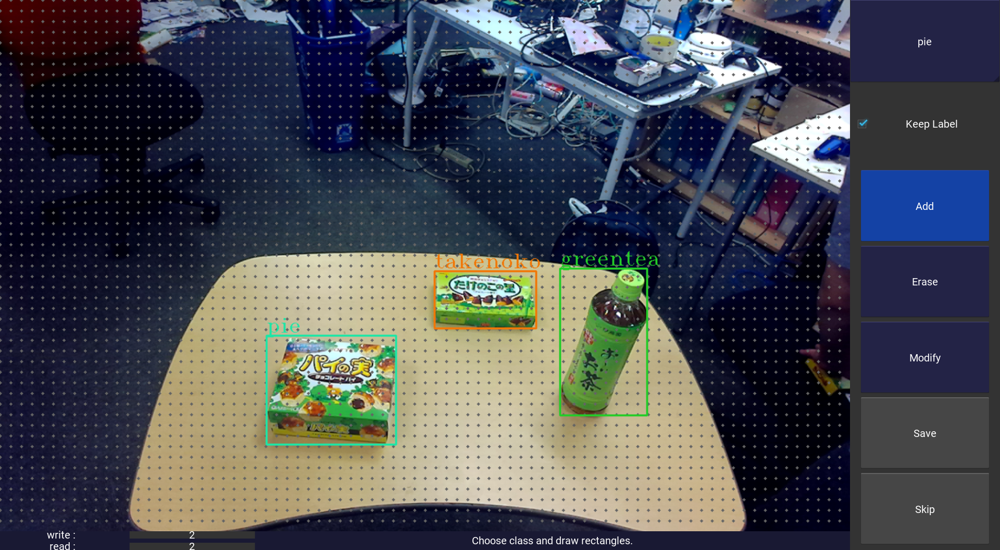
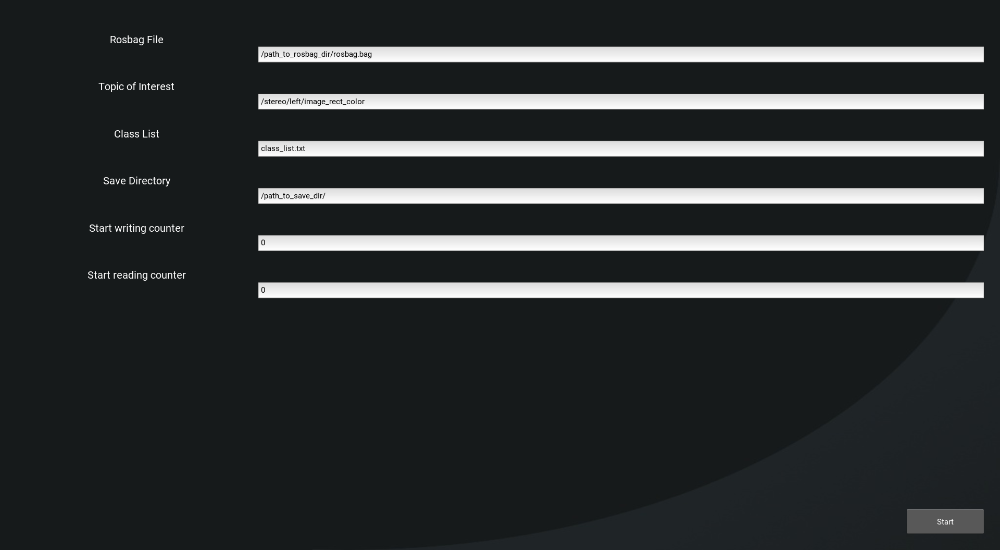

# Image annotation tools #

Tools for generating iamge dataset for digits from rosbag.

TBD: caffe and chainer style dataset generating

## 1. Requirements ##

- ROS(indigo or newer)
- OpenCV(only checked on version 3.1.0)
- [imgaug](tmp_data/conveni_data/8class_train_data)
- [kivy](tmp_data/conveni_data/8class_train_data)
- xsel
- xclip

---

## 2. Image Annotation ##

### 2-1. GUI Annotation Tool ###



Usage:  
```
$ ./image_annotation.py
```

Then you can input parameters as the image below:


Click 'Start' button to start annotation.

### 2-2. CUI Annotation Tool ###

Usage:  
1. Revise image_topic and save_directory in cui_image_annotation.py(L17,18).  
2. Write class list text file. Sample is class_list.txt  
3. Run image_annotation as below.  
4. There will be two directories named images and labels in save_directory where images contains images, labels contains annotation labels.
```
$ ./cui_image_annotatin.py <bagfile_name> <class_list>
```

You can see detailed usage for labelling by type 'h' after start running image_annotation.

---

## 3. Data augmentation ##

```
$ ./image_augmentation.py <data_directory> <save_directory> <class_list>
```

---

## 4. Split training data and validation data ##

```
$ ./split_train_val.py <data_directory> <save_directory>
```

## 5. Check annotation ##

You can check annotation result as:  
```
$ ./check_annotation.py <data_directory> <class_list>
```

data_directory is same as save_directory you defined for annotation.
