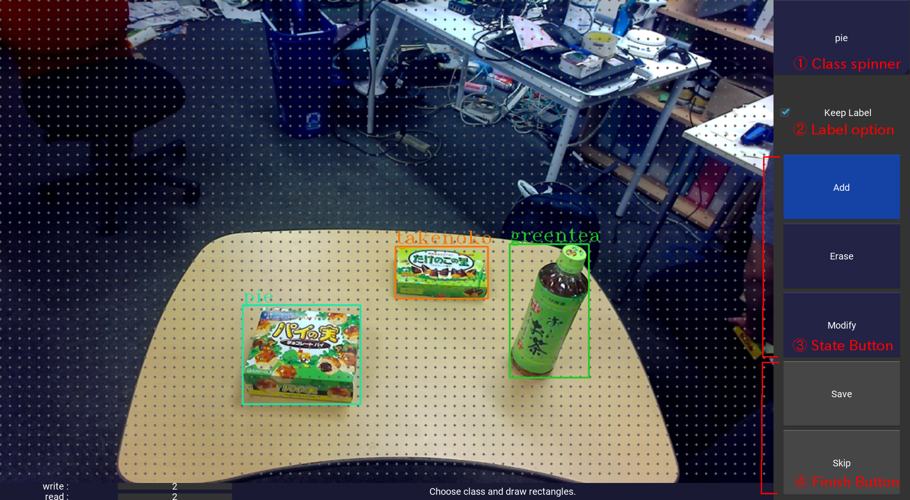

# Rosbag annotation #

Annotation tool for generating detection dataset for digits and chainer from rosbag.


## 1. Requirements ##

- ROS(indigo or newer)
- OpenCV(only checked on version 3.1.0)

---

## 2. Installation ##

### 2-1. Setup annotation tool ###

install.sh will install all requirements.  
```
 ./install.sh
```

- [kivy](https://kivy.org/docs/installation/installation-linux.html) : for annotation
- [imgaug](https://github.com/aleju/imgaug) : for augmentation

**\*CAUTION\***

install.sh installs cython(0.25.2) and pygame from pip.  
Install imgaug and kivy manually if you are using different version for cython.

### 2-2. Setup chainer dataset ###

**Setup**

```
cd modules
sudo python setup.py install
```

**Module Usage : TBD**

---

## 3. Image Annotation ##

### 3-1. GUI Annotation Tool ###

Usage:  
```
 ./image_annotation.py
```

Then you can input parameters as the image below:


Parameters are:  
- Rosbag File : source rosbag file full path which contains Sensor\_msgs/Image topic data.  
- Topic of Interest : Name of the image topic  
- Class List : Full path to the text file which contains a list of classes. Sample is class\_list.txt  
- Save Directory : Full path to the directory to save annotated dataset.  
- Start writing counter : Number of topic reading iterations before annotation  
- Start reading counter : This tool will start saving data with this number.

Click 'Start' button to start annotation.



Annotation usage:
- 1. Class spinner : Selected class name for adding new label.  
- 2. Label option  : If activated, keep previous labels in save/skip  
- 3. Sate button   :  
  * Add    : add new label (selected class)  
  * Erase  : erase clicked label  
  * Modify : Reshape label by dragging a vertex of the label, move by dragging the center.  
- 4. Finish button :
  * Save   : Save current image and labels, go to next image.  
  * Skip   : Go to next image without saving.

Annotated dataset will be saved in <Save Directory>/images/ and <Save Directory>/labels/.  
Those data have digits detection format (same as KITTI except score).  
You can use the dataset from chainer with rosbag\_annotaion.chainer\_dataset module.

### 3-2. CUI Annotation Tool (deprecated) ###

Usage:  
1. Revise image\_topic and save\_directory in cui\_image_annotation.py(L17,18).  
2. Write class list text file. Sample is class\_list.txt  
3. Run image\_annotation as below.  
4. There will be two directories named images and labels in save\_directory where images contains images, labels contains annotation labels.

```
$ ./cui_image_annotatin.py <bagfile_name> <class_list>
```

You can see detailed usage for labelling by type 'h' after start running image\_annotation.

---

## 3. Data augmentation ##

```
$ ./image_augmentation.py <data_directory> <save_directory> <class_list>
```

---

## 4. Split training data and validation data ##

```
$ ./split_train_val.py <data_directory> <save_directory>
```

## 5. Check annotation ##

You can check annotation result as:  
```
$ ./check_annotation.py <data_directory> <class_list>
```

data\_directory is same as save\_directory you defined for annotation.
